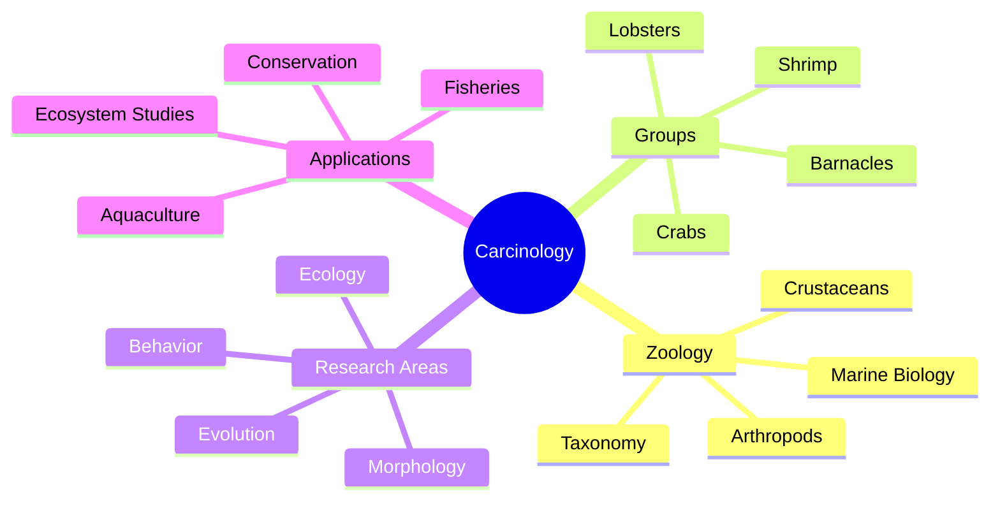

```mermaid
mindmap
  root((Carcinology))
    Zoology
      Crustaceans
      Arthropods
      Marine Biology
      Taxonomy
    Groups
      Crabs
      Lobsters
      Shrimp
      Barnacles
    Research Areas
      Morphology
      Behavior
      Ecology
      Evolution
    Applications
      Fisheries
      Aquaculture
      Conservation
      Ecosystem Studies
```

