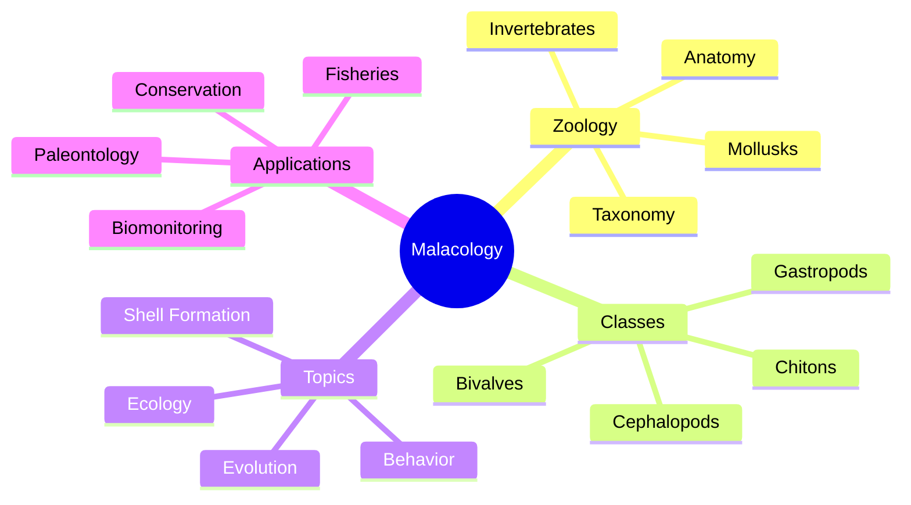

```mermaid
mindmap
  root((Malacology))
    Zoology
      Mollusks
      Invertebrates
      Taxonomy
      Anatomy
    Classes
      Gastropods
      Bivalves
      Cephalopods
      Chitons
    Topics
      Shell Formation
      Behavior
      Ecology
      Evolution
    Applications
      Fisheries
      Paleontology
      Biomonitoring
      Conservation
```

