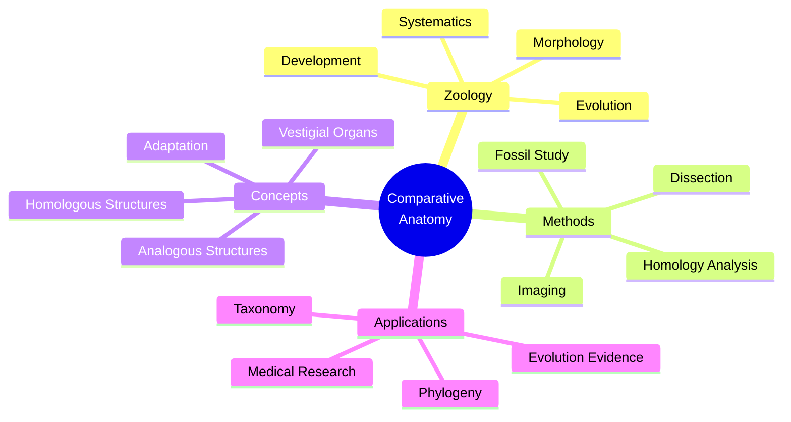

```mermaid
mindmap
  root((Comparative<br/>Anatomy))
    Zoology
      Morphology
      Evolution
      Systematics
      Development
    Methods
      Dissection
      Imaging
      Homology Analysis
      Fossil Study
    Concepts
      Homologous Structures
      Analogous Structures
      Vestigial Organs
      Adaptation
    Applications
      Phylogeny
      Evolution Evidence
      Medical Research
      Taxonomy
```

