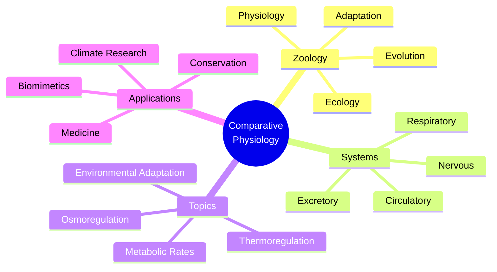

```mermaid
mindmap
  root((Comparative<br/>Physiology))
    Zoology
      Physiology
      Evolution
      Adaptation
      Ecology
    Systems
      Respiratory
      Circulatory
      Nervous
      Excretory
    Topics
      Environmental Adaptation
      Metabolic Rates
      Thermoregulation
      Osmoregulation
    Applications
      Biomimetics
      Conservation
      Medicine
      Climate Research
```

