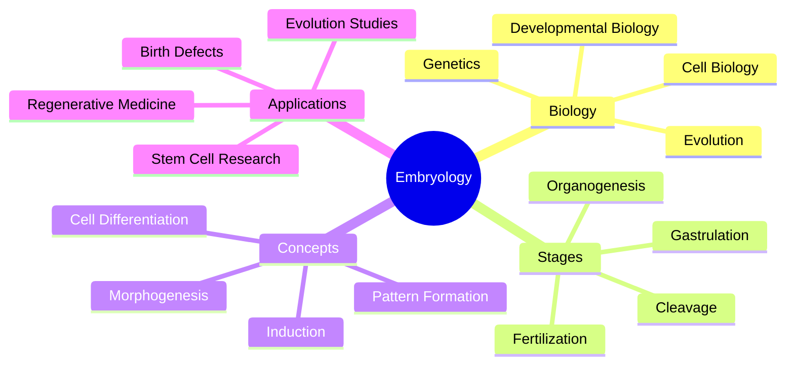

```mermaid
mindmap
  root((Embryology))
    Biology
      Developmental Biology
      Cell Biology
      Genetics
      Evolution
    Stages
      Fertilization
      Cleavage
      Gastrulation
      Organogenesis
    Concepts
      Cell Differentiation
      Morphogenesis
      Pattern Formation
      Induction
    Applications
      Stem Cell Research
      Regenerative Medicine
      Birth Defects
      Evolution Studies
```

