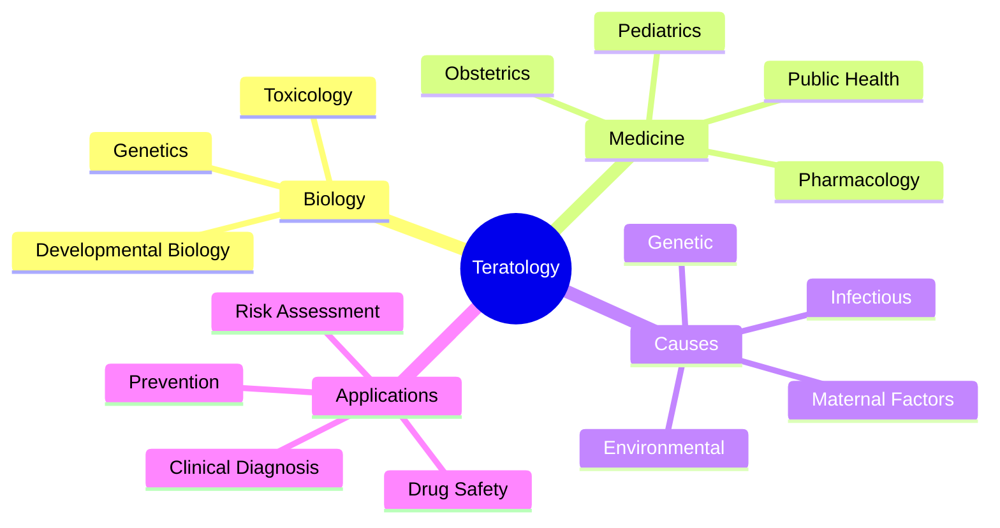

```mermaid
mindmap
  root((Teratology))
    Biology
      Developmental Biology
      Genetics
      Toxicology
    Medicine
      Obstetrics
      Pediatrics
      Public Health
      Pharmacology
    Causes
      Genetic
      Environmental
      Infectious
      Maternal Factors
    Applications
      Drug Safety
      Prevention
      Risk Assessment
      Clinical Diagnosis
```

