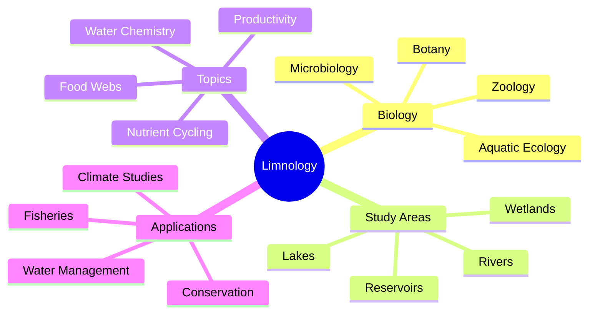

```mermaid
mindmap
  root((Limnology))
    Biology
      Aquatic Ecology
      Microbiology
      Zoology
      Botany
    Study Areas
      Lakes
      Rivers
      Wetlands
      Reservoirs
    Topics
      Water Chemistry
      Nutrient Cycling
      Food Webs
      Productivity
    Applications
      Water Management
      Conservation
      Fisheries
      Climate Studies
```

