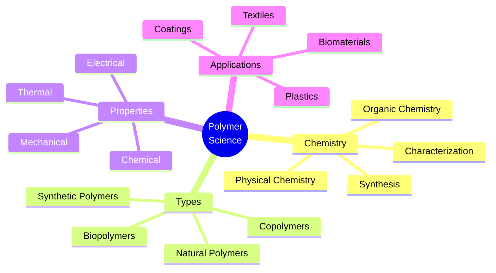

```mermaid
mindmap
  root((Polymer<br/>Science))
    Chemistry
      Organic Chemistry
      Physical Chemistry
      Synthesis
      Characterization
    Types
      Natural Polymers
      Synthetic Polymers
      Biopolymers
      Copolymers
    Properties
      Mechanical
      Thermal
      Electrical
      Chemical
    Applications
      Plastics
      Textiles
      Biomaterials
      Coatings
```

