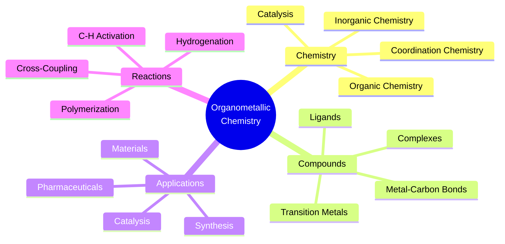

```mermaid
mindmap
  root((Organometallic<br/>Chemistry))
    Chemistry
      Organic Chemistry
      Inorganic Chemistry
      Coordination Chemistry
      Catalysis
    Compounds
      Metal-Carbon Bonds
      Complexes
      Ligands
      Transition Metals
    Applications
      Catalysis
      Synthesis
      Materials
      Pharmaceuticals
    Reactions
      Cross-Coupling
      Hydrogenation
      Polymerization
      C-H Activation
```

