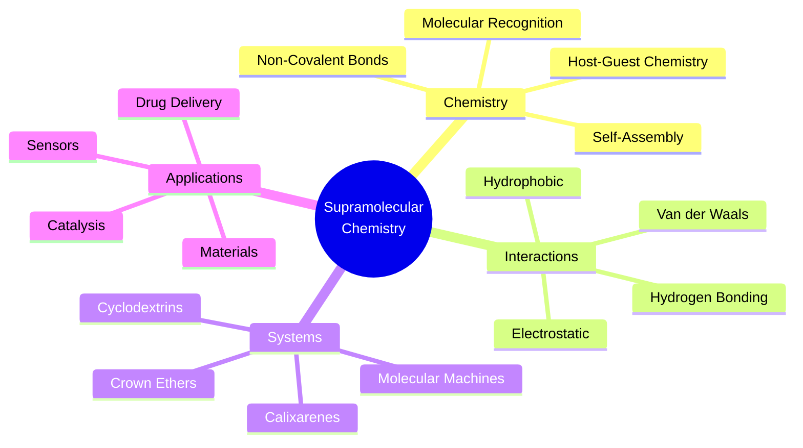

```mermaid
mindmap
  root((Supramolecular<br/>Chemistry))
    Chemistry
      Molecular Recognition
      Self-Assembly
      Host-Guest Chemistry
      Non-Covalent Bonds
    Interactions
      Hydrogen Bonding
      Van der Waals
      Electrostatic
      Hydrophobic
    Systems
      Crown Ethers
      Cyclodextrins
      Calixarenes
      Molecular Machines
    Applications
      Drug Delivery
      Sensors
      Catalysis
      Materials
```

