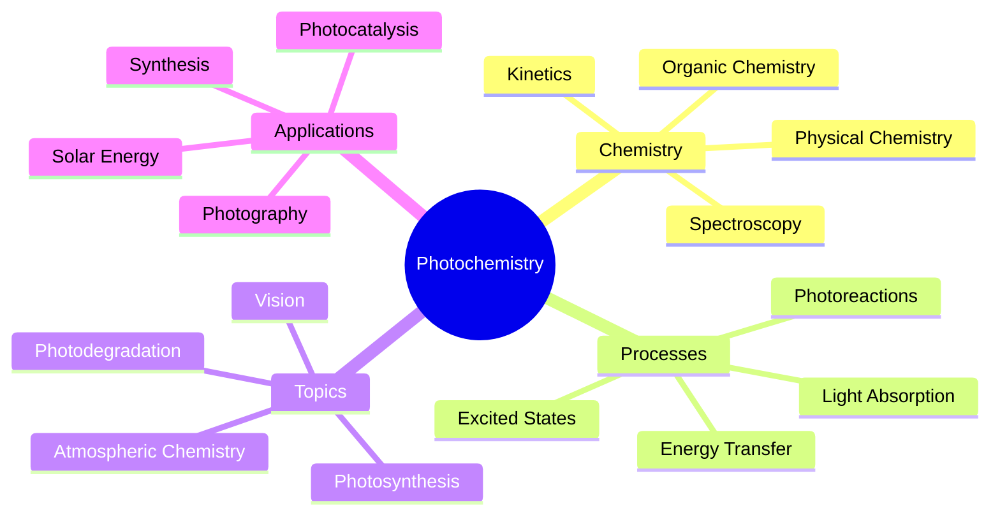

```mermaid
mindmap
  root((Photochemistry))
    Chemistry
      Physical Chemistry
      Organic Chemistry
      Spectroscopy
      Kinetics
    Processes
      Light Absorption
      Excited States
      Photoreactions
      Energy Transfer
    Topics
      Photosynthesis
      Vision
      Atmospheric Chemistry
      Photodegradation
    Applications
      Solar Energy
      Photocatalysis
      Photography
      Synthesis
```

