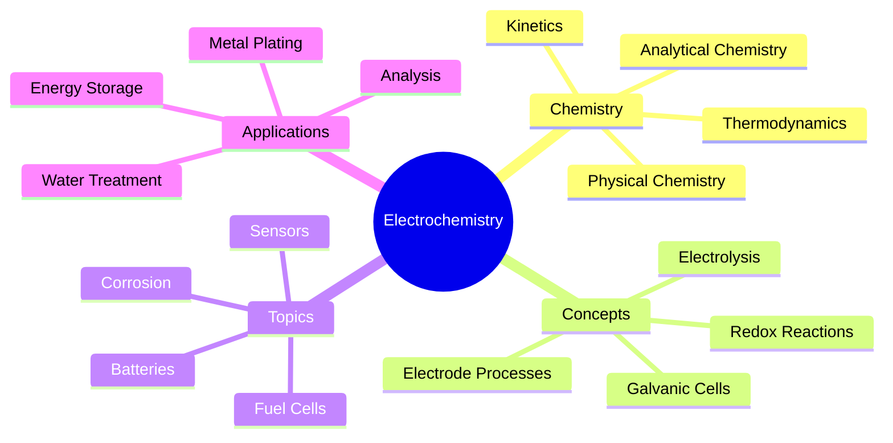

```mermaid
mindmap
  root((Electrochemistry))
    Chemistry
      Physical Chemistry
      Analytical Chemistry
      Thermodynamics
      Kinetics
    Concepts
      Redox Reactions
      Electrode Processes
      Electrolysis
      Galvanic Cells
    Topics
      Batteries
      Fuel Cells
      Corrosion
      Sensors
    Applications
      Energy Storage
      Metal Plating
      Water Treatment
      Analysis
```

