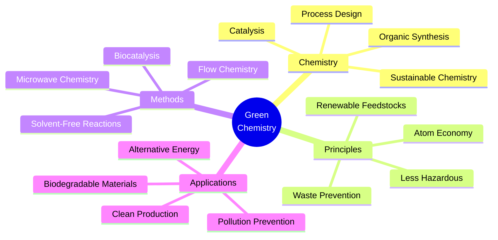

```mermaid
mindmap
  root((Green<br/>Chemistry))
    Chemistry
      Sustainable Chemistry
      Organic Synthesis
      Catalysis
      Process Design
    Principles
      Waste Prevention
      Atom Economy
      Less Hazardous
      Renewable Feedstocks
    Methods
      Biocatalysis
      Solvent-Free Reactions
      Microwave Chemistry
      Flow Chemistry
    Applications
      Clean Production
      Alternative Energy
      Biodegradable Materials
      Pollution Prevention
```

