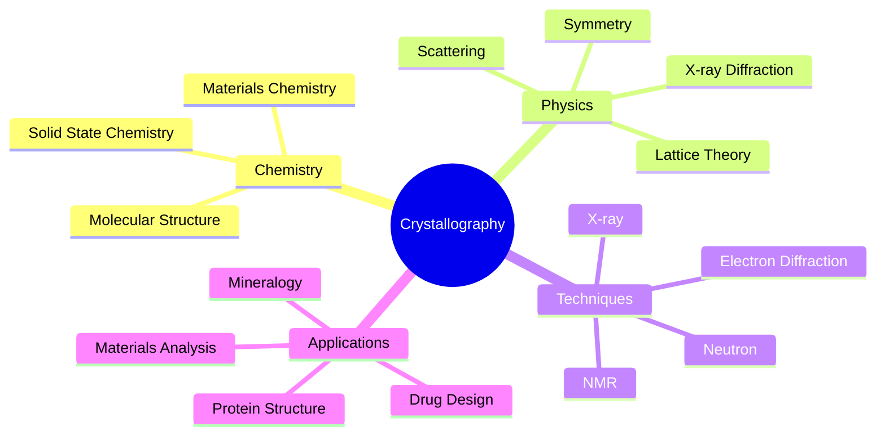

```mermaid
mindmap
  root((Crystallography))
    Chemistry
      Solid State Chemistry
      Molecular Structure
      Materials Chemistry
    Physics
      X-ray Diffraction
      Symmetry
      Lattice Theory
      Scattering
    Techniques
      X-ray
      Neutron
      Electron Diffraction
      NMR
    Applications
      Drug Design
      Protein Structure
      Materials Analysis
      Mineralogy
```

