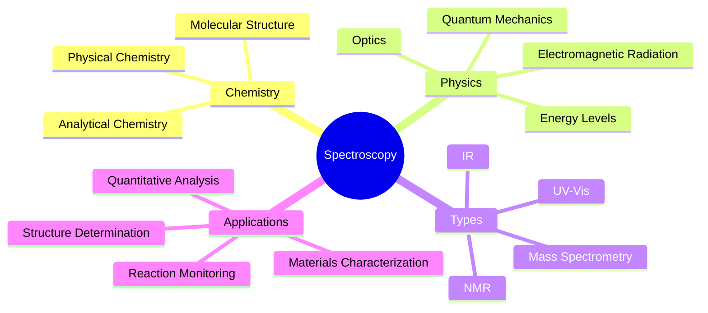

```mermaid
mindmap
  root((Spectroscopy))
    Chemistry
      Analytical Chemistry
      Physical Chemistry
      Molecular Structure
    Physics
      Electromagnetic Radiation
      Quantum Mechanics
      Energy Levels
      Optics
    Types
      UV-Vis
      IR
      NMR
      Mass Spectrometry
    Applications
      Structure Determination
      Quantitative Analysis
      Reaction Monitoring
      Materials Characterization
```

