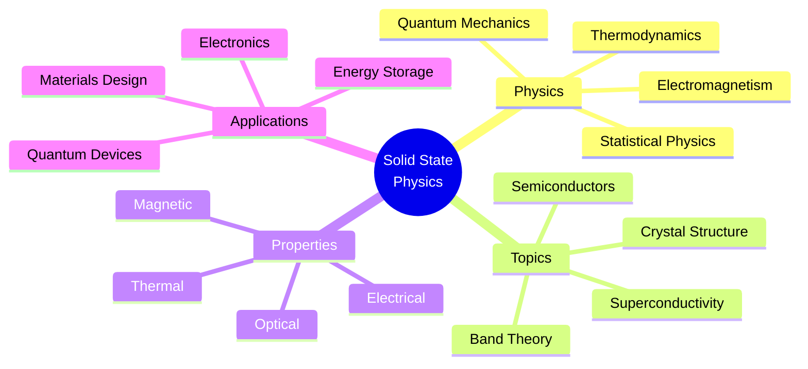

```mermaid
mindmap
  root((Solid State<br/>Physics))
    Physics
      Quantum Mechanics
      Statistical Physics
      Electromagnetism
      Thermodynamics
    Topics
      Crystal Structure
      Band Theory
      Semiconductors
      Superconductivity
    Properties
      Electrical
      Magnetic
      Optical
      Thermal
    Applications
      Electronics
      Materials Design
      Quantum Devices
      Energy Storage
```

