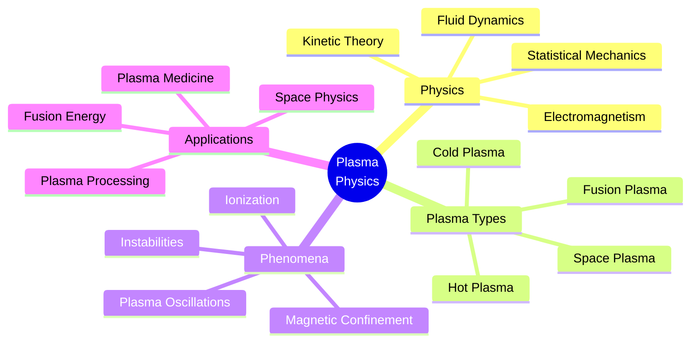

```mermaid
mindmap
  root((Plasma<br/>Physics))
    Physics
      Electromagnetism
      Fluid Dynamics
      Statistical Mechanics
      Kinetic Theory
    Plasma Types
      Hot Plasma
      Cold Plasma
      Fusion Plasma
      Space Plasma
    Phenomena
      Ionization
      Magnetic Confinement
      Plasma Oscillations
      Instabilities
    Applications
      Fusion Energy
      Plasma Processing
      Space Physics
      Plasma Medicine
```

