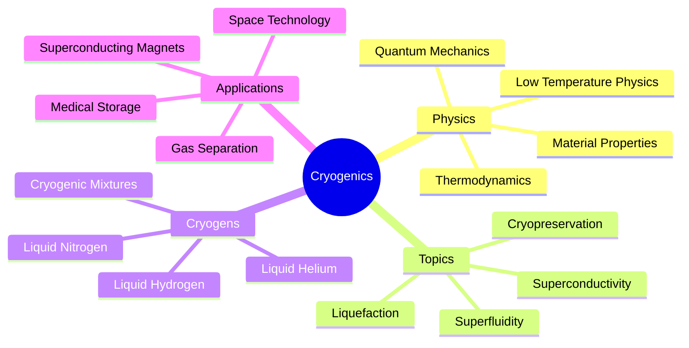

```mermaid
mindmap
  root((Cryogenics))
    Physics
      Thermodynamics
      Low Temperature Physics
      Quantum Mechanics
      Material Properties
    Topics
      Liquefaction
      Superconductivity
      Superfluidity
      Cryopreservation
    Cryogens
      Liquid Nitrogen
      Liquid Helium
      Liquid Hydrogen
      Cryogenic Mixtures
    Applications
      Medical Storage
      Space Technology
      Superconducting Magnets
      Gas Separation
```

