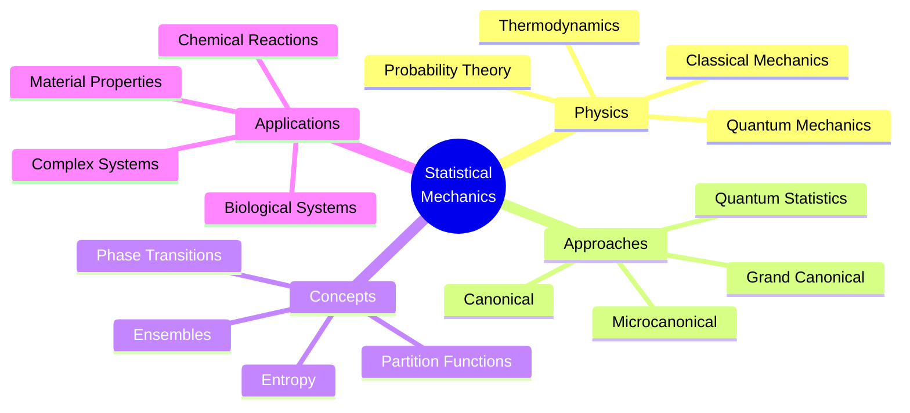

```mermaid
mindmap
  root((Statistical<br/>Mechanics))
    Physics
      Thermodynamics
      Probability Theory
      Quantum Mechanics
      Classical Mechanics
    Approaches
      Microcanonical
      Canonical
      Grand Canonical
      Quantum Statistics
    Concepts
      Entropy
      Phase Transitions
      Partition Functions
      Ensembles
    Applications
      Material Properties
      Chemical Reactions
      Biological Systems
      Complex Systems
```

