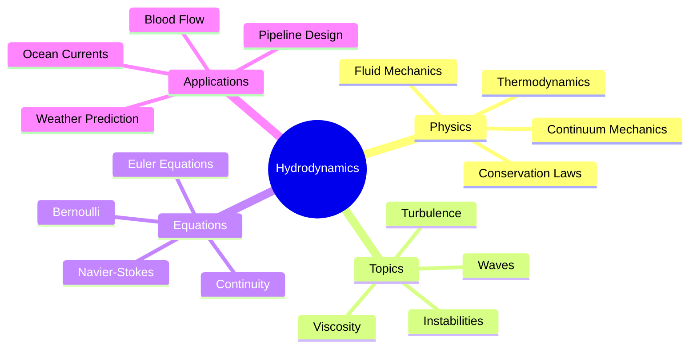

```mermaid
mindmap
  root((Hydrodynamics))
    Physics
      Fluid Mechanics
      Continuum Mechanics
      Thermodynamics
      Conservation Laws
    Topics
      Viscosity
      Turbulence
      Waves
      Instabilities
    Equations
      Navier-Stokes
      Euler Equations
      Bernoulli
      Continuity
    Applications
      Weather Prediction
      Ocean Currents
      Pipeline Design
      Blood Flow
```

