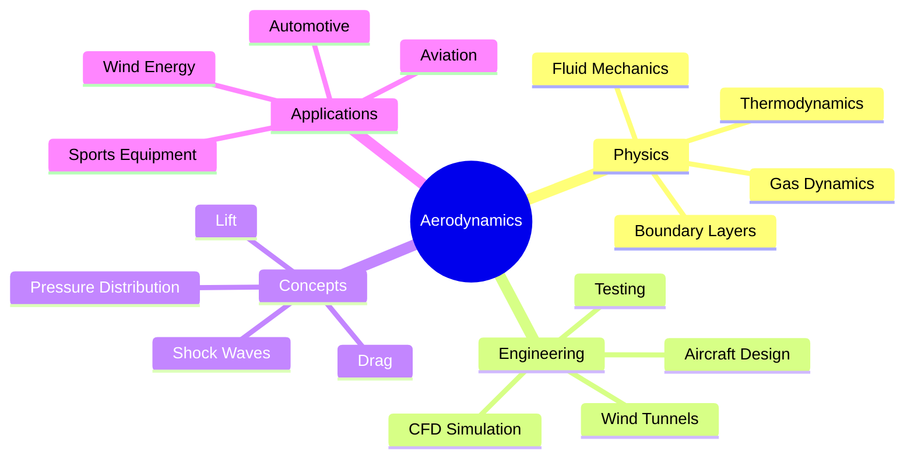

```mermaid
mindmap
  root((Aerodynamics))
    Physics
      Fluid Mechanics
      Gas Dynamics
      Thermodynamics
      Boundary Layers
    Engineering
      Aircraft Design
      Wind Tunnels
      CFD Simulation
      Testing
    Concepts
      Lift
      Drag
      Pressure Distribution
      Shock Waves
    Applications
      Aviation
      Automotive
      Wind Energy
      Sports Equipment
```

