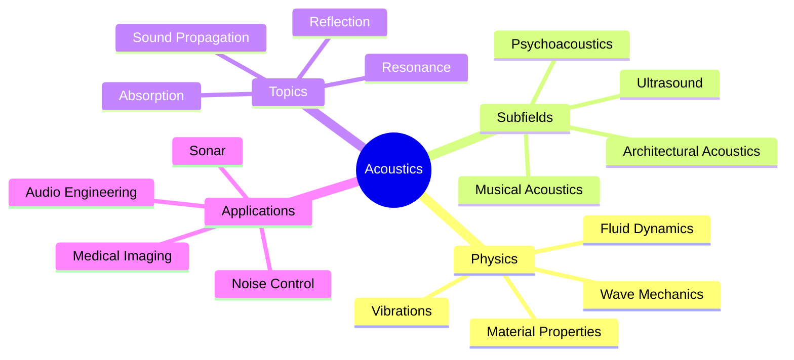

```mermaid
mindmap
  root((Acoustics))
    Physics
      Wave Mechanics
      Vibrations
      Fluid Dynamics
      Material Properties
    Subfields
      Musical Acoustics
      Architectural Acoustics
      Ultrasound
      Psychoacoustics
    Topics
      Sound Propagation
      Resonance
      Reflection
      Absorption
    Applications
      Audio Engineering
      Noise Control
      Medical Imaging
      Sonar
```

