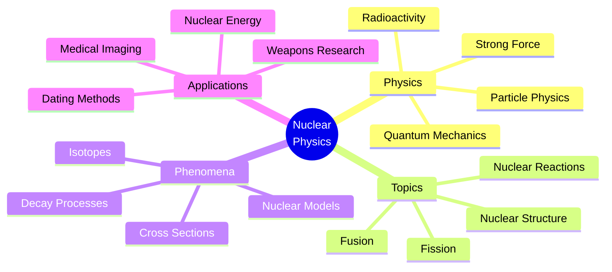

```mermaid
mindmap
  root((Nuclear<br/>Physics))
    Physics
      Quantum Mechanics
      Particle Physics
      Radioactivity
      Strong Force
    Topics
      Nuclear Structure
      Nuclear Reactions
      Fission
      Fusion
    Phenomena
      Decay Processes
      Isotopes
      Nuclear Models
      Cross Sections
    Applications
      Nuclear Energy
      Medical Imaging
      Dating Methods
      Weapons Research
```

