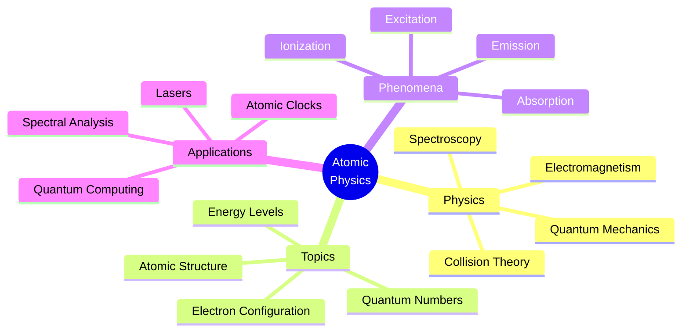

```mermaid
mindmap
  root((Atomic<br/>Physics))
    Physics
      Quantum Mechanics
      Electromagnetism
      Spectroscopy
      Collision Theory
    Topics
      Atomic Structure
      Energy Levels
      Electron Configuration
      Quantum Numbers
    Phenomena
      Absorption
      Emission
      Ionization
      Excitation
    Applications
      Lasers
      Atomic Clocks
      Quantum Computing
      Spectral Analysis
```

