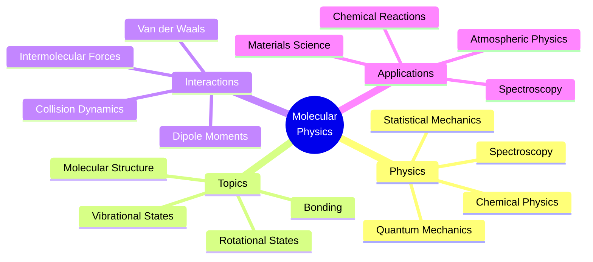

```mermaid
mindmap
  root((Molecular<br/>Physics))
    Physics
      Quantum Mechanics
      Chemical Physics
      Spectroscopy
      Statistical Mechanics
    Topics
      Molecular Structure
      Bonding
      Rotational States
      Vibrational States
    Interactions
      Van der Waals
      Dipole Moments
      Intermolecular Forces
      Collision Dynamics
    Applications
      Spectroscopy
      Chemical Reactions
      Materials Science
      Atmospheric Physics
```

