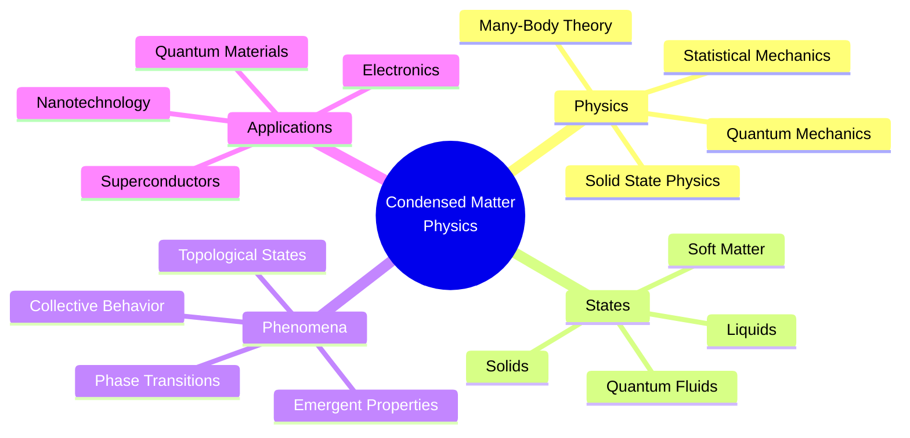

```mermaid
mindmap
  root((Condensed Matter<br/>Physics))
    Physics
      Quantum Mechanics
      Statistical Mechanics
      Solid State Physics
      Many-Body Theory
    States
      Solids
      Liquids
      Soft Matter
      Quantum Fluids
    Phenomena
      Phase Transitions
      Emergent Properties
      Collective Behavior
      Topological States
    Applications
      Electronics
      Quantum Materials
      Nanotechnology
      Superconductors
```

