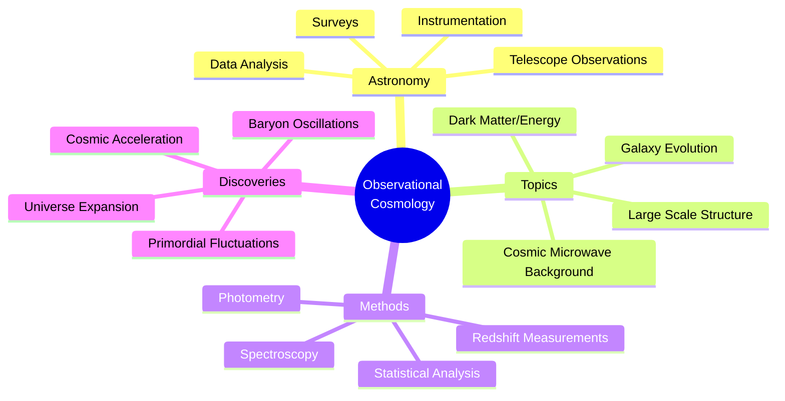

```mermaid
mindmap
  root((Observational<br/>Cosmology))
    Astronomy
      Telescope Observations
      Data Analysis
      Instrumentation
      Surveys
    Topics
      Cosmic Microwave Background
      Large Scale Structure
      Galaxy Evolution
      Dark Matter/Energy
    Methods
      Photometry
      Spectroscopy
      Redshift Measurements
      Statistical Analysis
    Discoveries
      Universe Expansion
      Cosmic Acceleration
      Primordial Fluctuations
      Baryon Oscillations
```

