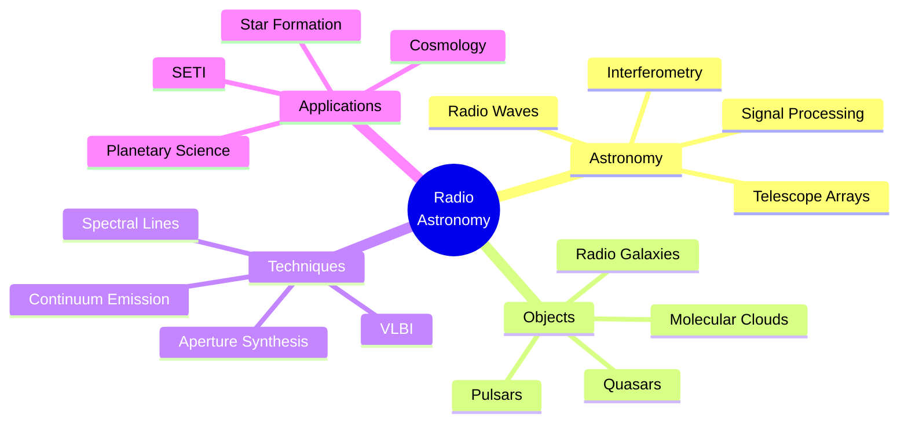

```mermaid
mindmap
  root((Radio<br/>Astronomy))
    Astronomy
      Radio Waves
      Interferometry
      Signal Processing
      Telescope Arrays
    Objects
      Pulsars
      Quasars
      Radio Galaxies
      Molecular Clouds
    Techniques
      VLBI
      Aperture Synthesis
      Spectral Lines
      Continuum Emission
    Applications
      Cosmology
      Star Formation
      Planetary Science
      SETI
```

