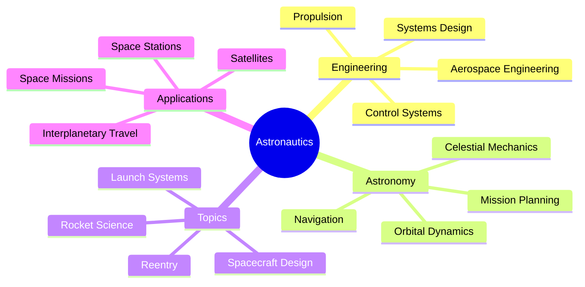

```mermaid
mindmap
  root((Astronautics))
    Engineering
      Aerospace Engineering
      Propulsion
      Systems Design
      Control Systems
    Astronomy
      Celestial Mechanics
      Orbital Dynamics
      Navigation
      Mission Planning
    Topics
      Rocket Science
      Spacecraft Design
      Launch Systems
      Reentry
    Applications
      Space Missions
      Satellites
      Space Stations
      Interplanetary Travel
```

