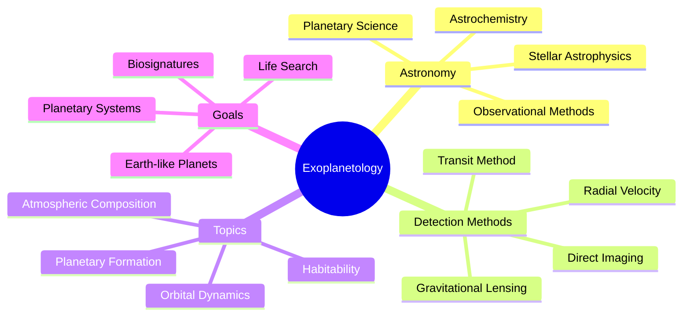

```mermaid
mindmap
  root((Exoplanetology))
    Astronomy
      Planetary Science
      Stellar Astrophysics
      Astrochemistry
      Observational Methods
    Detection Methods
      Transit Method
      Radial Velocity
      Direct Imaging
      Gravitational Lensing
    Topics
      Planetary Formation
      Habitability
      Atmospheric Composition
      Orbital Dynamics
    Goals
      Earth-like Planets
      Biosignatures
      Planetary Systems
      Life Search
```

