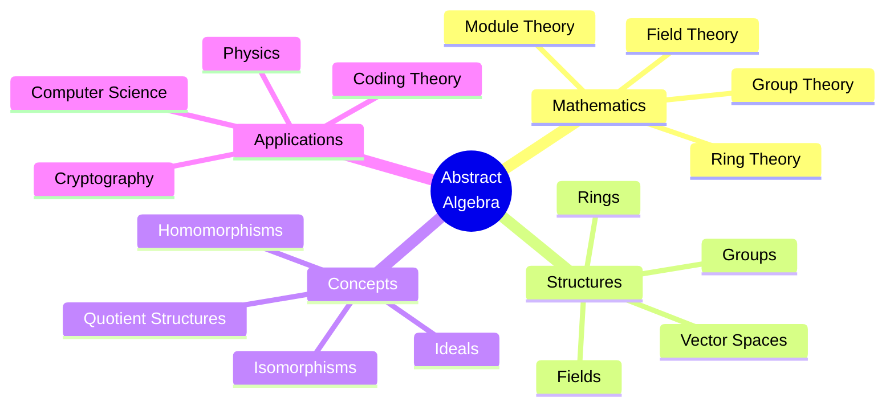

```mermaid
mindmap
  root((Abstract<br/>Algebra))
    Mathematics
      Group Theory
      Ring Theory
      Field Theory
      Module Theory
    Structures
      Groups
      Rings
      Fields
      Vector Spaces
    Concepts
      Homomorphisms
      Isomorphisms
      Ideals
      Quotient Structures
    Applications
      Cryptography
      Coding Theory
      Physics
      Computer Science
```

