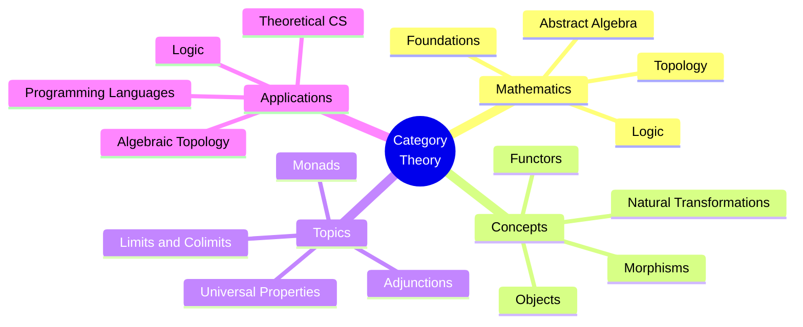

```mermaid
mindmap
  root((Category<br/>Theory))
    Mathematics
      Abstract Algebra
      Logic
      Topology
      Foundations
    Concepts
      Objects
      Morphisms
      Functors
      Natural Transformations
    Topics
      Universal Properties
      Limits and Colimits
      Adjunctions
      Monads
    Applications
      Programming Languages
      Algebraic Topology
      Logic
      Theoretical CS
```

