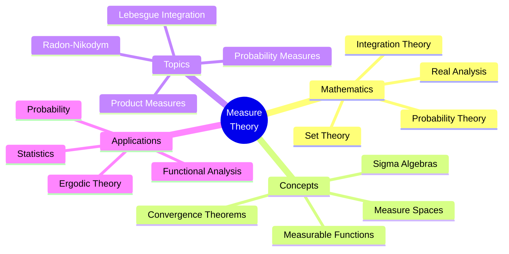

```mermaid
mindmap
  root((Measure<br/>Theory))
    Mathematics
      Real Analysis
      Probability Theory
      Integration Theory
      Set Theory
    Concepts
      Measure Spaces
      Sigma Algebras
      Measurable Functions
      Convergence Theorems
    Topics
      Lebesgue Integration
      Probability Measures
      Product Measures
      Radon-Nikodym
    Applications
      Probability
      Functional Analysis
      Ergodic Theory
      Statistics
```

