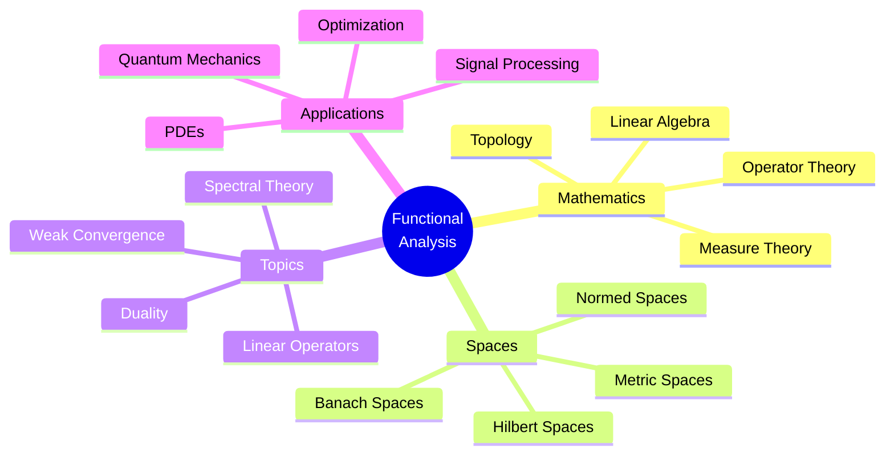

```mermaid
mindmap
  root((Functional<br/>Analysis))
    Mathematics
      Linear Algebra
      Topology
      Measure Theory
      Operator Theory
    Spaces
      Banach Spaces
      Hilbert Spaces
      Normed Spaces
      Metric Spaces
    Topics
      Linear Operators
      Spectral Theory
      Duality
      Weak Convergence
    Applications
      Quantum Mechanics
      PDEs
      Optimization
      Signal Processing
```

