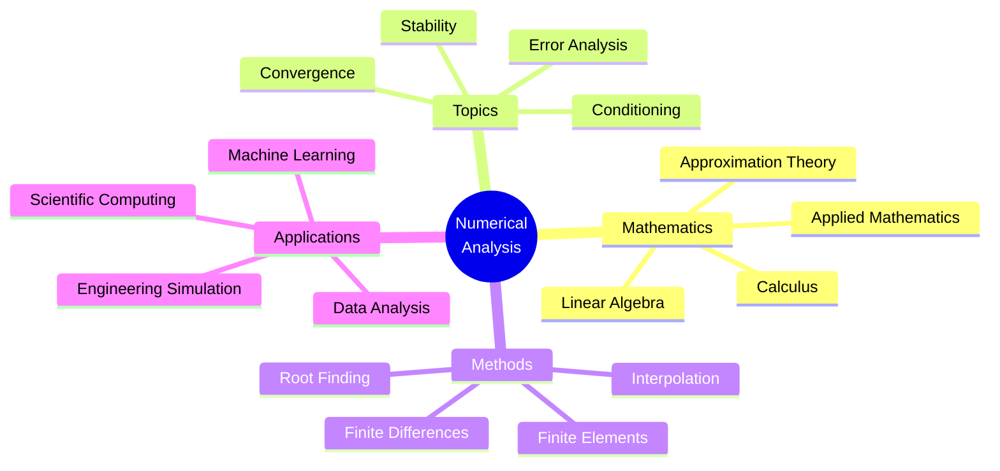

```mermaid
mindmap
  root((Numerical<br/>Analysis))
    Mathematics
      Applied Mathematics
      Calculus
      Linear Algebra
      Approximation Theory
    Topics
      Error Analysis
      Stability
      Convergence
      Conditioning
    Methods
      Finite Differences
      Finite Elements
      Interpolation
      Root Finding
    Applications
      Scientific Computing
      Engineering Simulation
      Data Analysis
      Machine Learning
```

