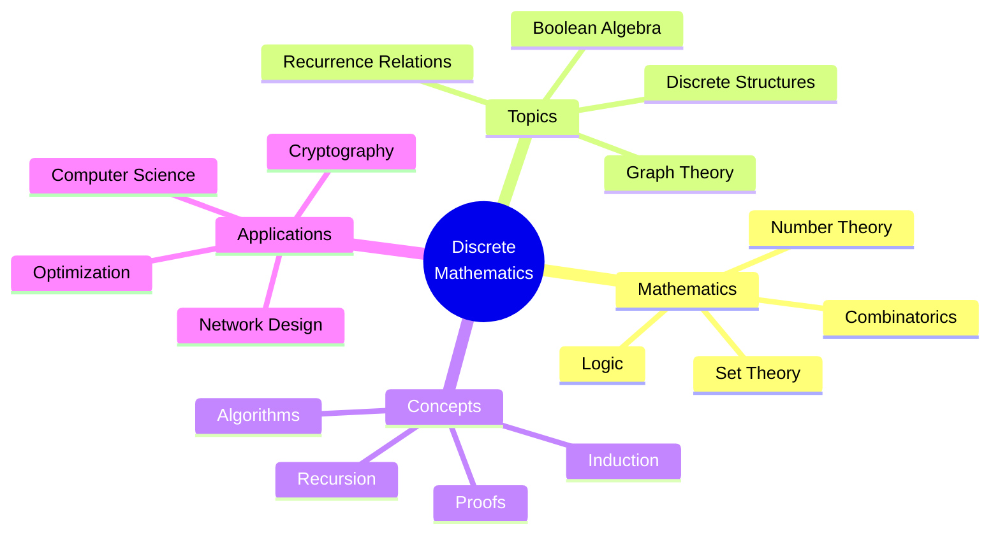

```mermaid
mindmap
  root((Discrete<br/>Mathematics))
    Mathematics
      Logic
      Set Theory
      Number Theory
      Combinatorics
    Topics
      Graph Theory
      Boolean Algebra
      Recurrence Relations
      Discrete Structures
    Concepts
      Proofs
      Induction
      Recursion
      Algorithms
    Applications
      Computer Science
      Cryptography
      Network Design
      Optimization
```

