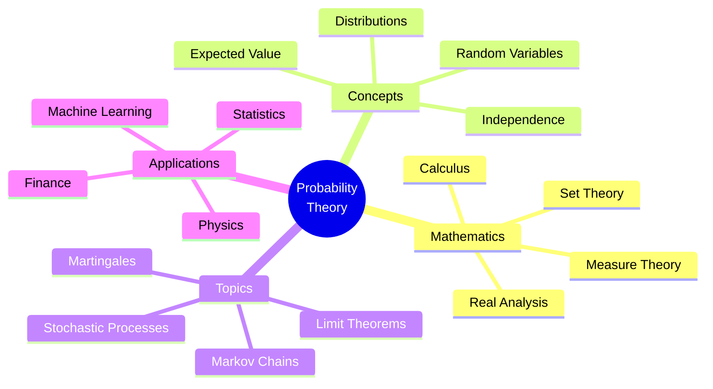

```mermaid
mindmap
  root((Probability<br/>Theory))
    Mathematics
      Measure Theory
      Set Theory
      Calculus
      Real Analysis
    Concepts
      Random Variables
      Distributions
      Expected Value
      Independence
    Topics
      Stochastic Processes
      Limit Theorems
      Markov Chains
      Martingales
    Applications
      Statistics
      Finance
      Physics
      Machine Learning
```

