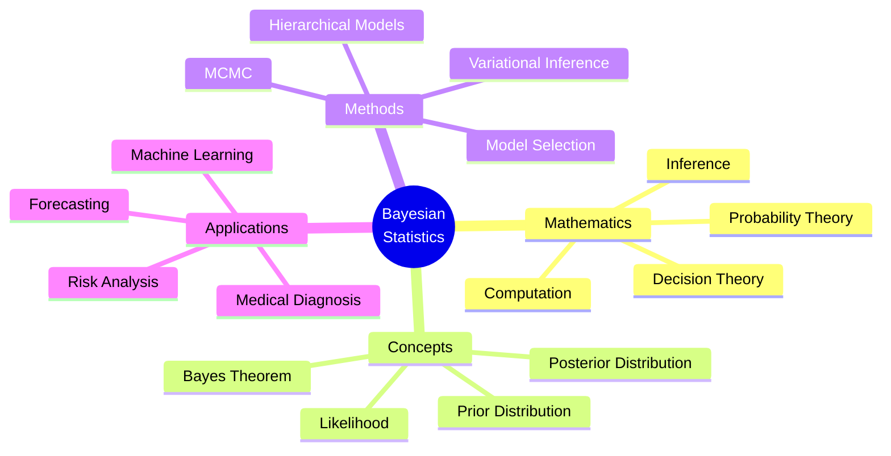

```mermaid
mindmap
  root((Bayesian<br/>Statistics))
    Mathematics
      Probability Theory
      Inference
      Decision Theory
      Computation
    Concepts
      Prior Distribution
      Posterior Distribution
      Likelihood
      Bayes Theorem
    Methods
      MCMC
      Variational Inference
      Hierarchical Models
      Model Selection
    Applications
      Machine Learning
      Medical Diagnosis
      Risk Analysis
      Forecasting
```

