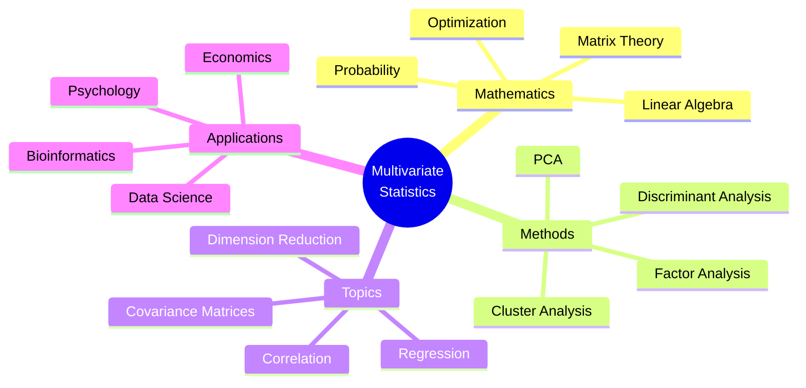

```mermaid
mindmap
  root((Multivariate<br/>Statistics))
    Mathematics
      Linear Algebra
      Probability
      Matrix Theory
      Optimization
    Methods
      PCA
      Factor Analysis
      Cluster Analysis
      Discriminant Analysis
    Topics
      Correlation
      Regression
      Covariance Matrices
      Dimension Reduction
    Applications
      Data Science
      Economics
      Psychology
      Bioinformatics
```

