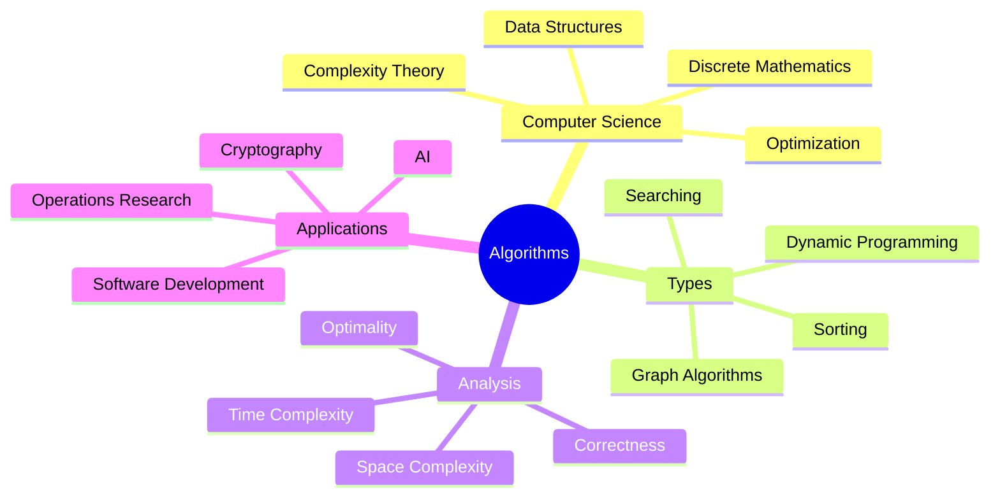

```mermaid
mindmap
  root((Algorithms))
    Computer Science
      Complexity Theory
      Data Structures
      Discrete Mathematics
      Optimization
    Types
      Sorting
      Searching
      Graph Algorithms
      Dynamic Programming
    Analysis
      Time Complexity
      Space Complexity
      Correctness
      Optimality
    Applications
      Software Development
      AI
      Cryptography
      Operations Research
```

