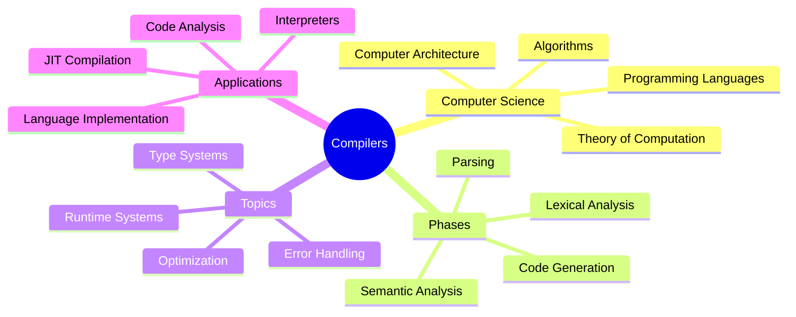

```mermaid
mindmap
  root((Compilers))
    Computer Science
      Programming Languages
      Theory of Computation
      Algorithms
      Computer Architecture
    Phases
      Lexical Analysis
      Parsing
      Semantic Analysis
      Code Generation
    Topics
      Optimization
      Type Systems
      Runtime Systems
      Error Handling
    Applications
      Language Implementation
      Interpreters
      JIT Compilation
      Code Analysis
```

