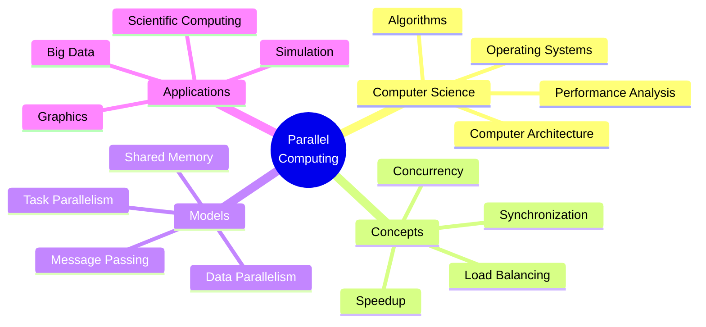

```mermaid
mindmap
  root((Parallel<br/>Computing))
    Computer Science
      Algorithms
      Computer Architecture
      Operating Systems
      Performance Analysis
    Concepts
      Concurrency
      Synchronization
      Load Balancing
      Speedup
    Models
      Shared Memory
      Message Passing
      Data Parallelism
      Task Parallelism
    Applications
      Scientific Computing
      Big Data
      Graphics
      Simulation
```

