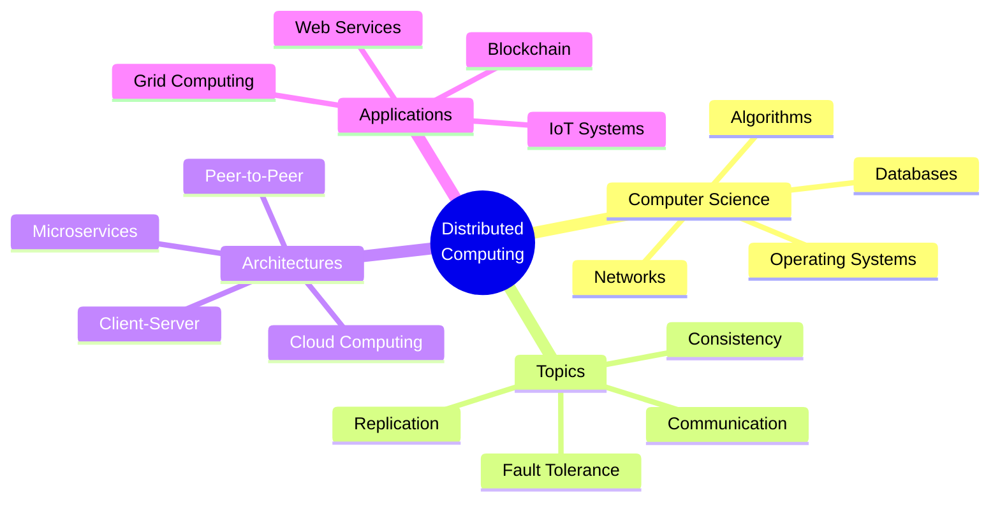

```mermaid
mindmap
  root((Distributed<br/>Computing))
    Computer Science
      Networks
      Operating Systems
      Algorithms
      Databases
    Topics
      Consistency
      Fault Tolerance
      Replication
      Communication
    Architectures
      Client-Server
      Peer-to-Peer
      Cloud Computing
      Microservices
    Applications
      Web Services
      Blockchain
      Grid Computing
      IoT Systems
```

