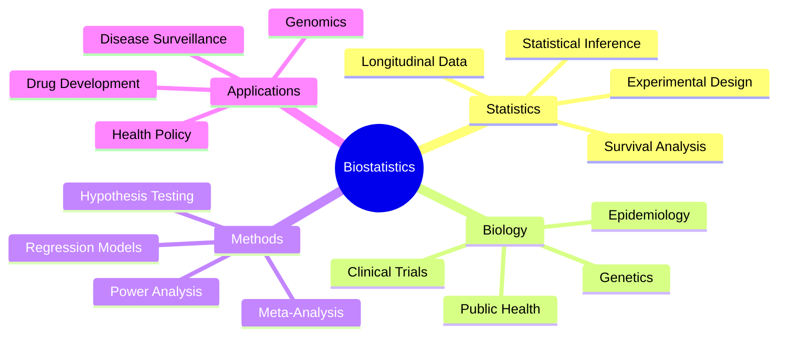

```mermaid
mindmap
  root((Biostatistics))
    Statistics
      Statistical Inference
      Experimental Design
      Survival Analysis
      Longitudinal Data
    Biology
      Epidemiology
      Clinical Trials
      Genetics
      Public Health
    Methods
      Hypothesis Testing
      Regression Models
      Meta-Analysis
      Power Analysis
    Applications
      Drug Development
      Disease Surveillance
      Health Policy
      Genomics
```

