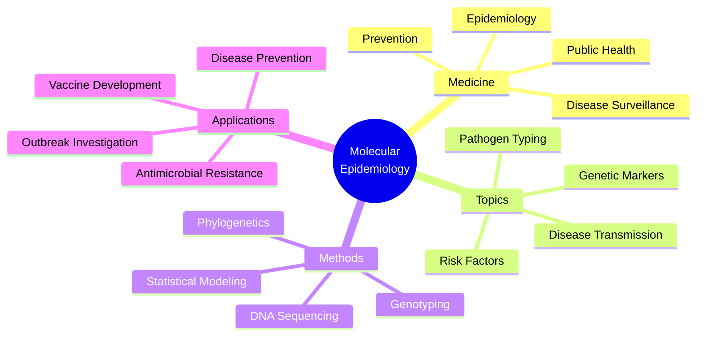

```mermaid
mindmap
  root((Molecular<br/>Epidemiology))
    Medicine
      Epidemiology
      Public Health
      Disease Surveillance
      Prevention
    Topics
      Genetic Markers
      Pathogen Typing
      Disease Transmission
      Risk Factors
    Methods
      DNA Sequencing
      Genotyping
      Phylogenetics
      Statistical Modeling
    Applications
      Outbreak Investigation
      Disease Prevention
      Vaccine Development
      Antimicrobial Resistance
```

