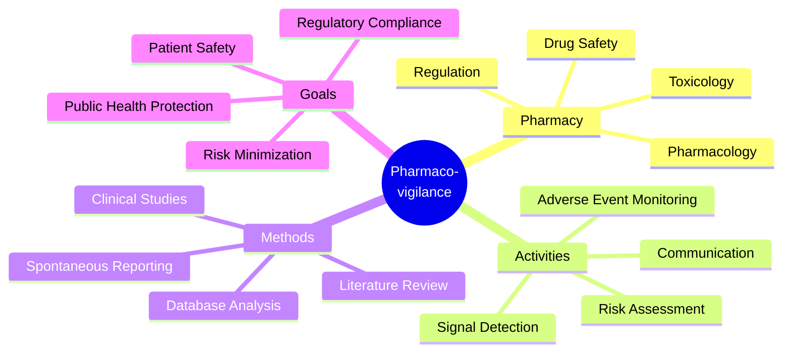

```mermaid
mindmap
  root((Pharmaco-<br/>vigilance))
    Pharmacy
      Drug Safety
      Pharmacology
      Toxicology
      Regulation
    Activities
      Adverse Event Monitoring
      Signal Detection
      Risk Assessment
      Communication
    Methods
      Spontaneous Reporting
      Database Analysis
      Clinical Studies
      Literature Review
    Goals
      Patient Safety
      Risk Minimization
      Public Health Protection
      Regulatory Compliance
```

