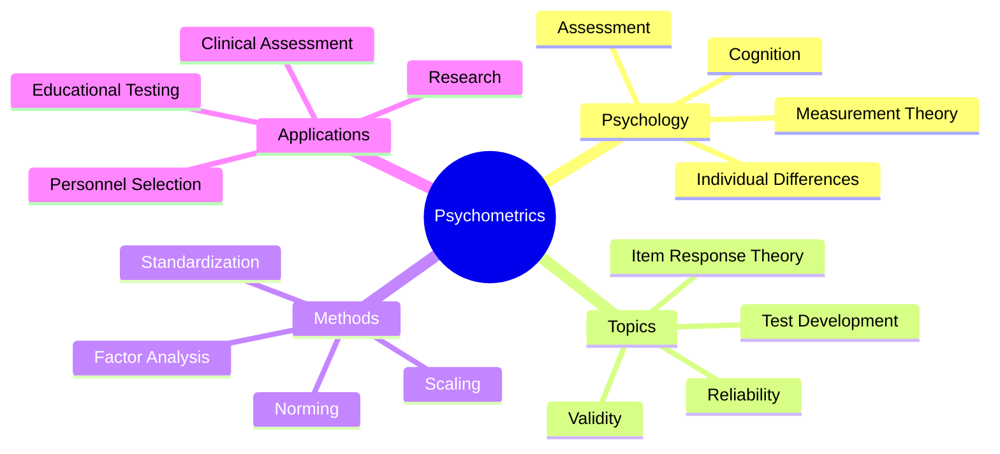

```mermaid
mindmap
  root((Psychometrics))
    Psychology
      Measurement Theory
      Assessment
      Cognition
      Individual Differences
    Topics
      Test Development
      Validity
      Reliability
      Item Response Theory
    Methods
      Factor Analysis
      Scaling
      Norming
      Standardization
    Applications
      Educational Testing
      Clinical Assessment
      Personnel Selection
      Research
```

