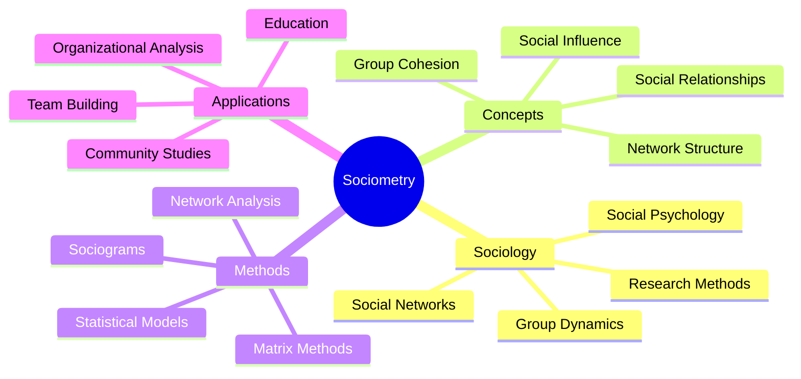

```mermaid
mindmap
  root((Sociometry))
    Sociology
      Social Networks
      Group Dynamics
      Social Psychology
      Research Methods
    Concepts
      Social Relationships
      Network Structure
      Social Influence
      Group Cohesion
    Methods
      Sociograms
      Network Analysis
      Matrix Methods
      Statistical Models
    Applications
      Organizational Analysis
      Education
      Community Studies
      Team Building
```

