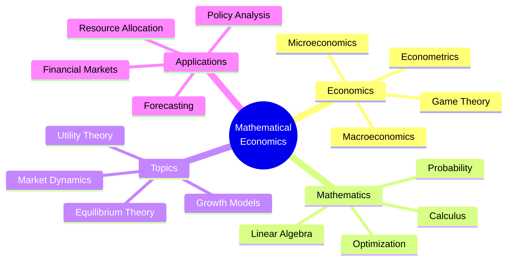

```mermaid
mindmap
  root((Mathematical<br/>Economics))
    Economics
      Microeconomics
      Macroeconomics
      Game Theory
      Econometrics
    Mathematics
      Calculus
      Optimization
      Linear Algebra
      Probability
    Topics
      Equilibrium Theory
      Growth Models
      Utility Theory
      Market Dynamics
    Applications
      Policy Analysis
      Financial Markets
      Resource Allocation
      Forecasting
```

