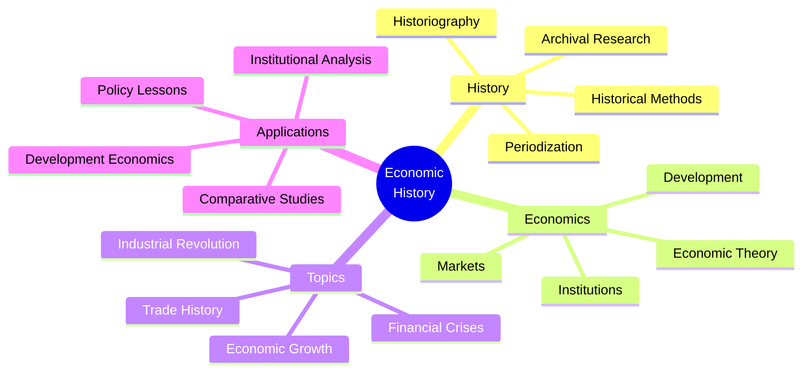

```mermaid
mindmap
  root((Economic<br/>History))
    History
      Historical Methods
      Archival Research
      Periodization
      Historiography
    Economics
      Economic Theory
      Markets
      Institutions
      Development
    Topics
      Industrial Revolution
      Trade History
      Financial Crises
      Economic Growth
    Applications
      Policy Lessons
      Institutional Analysis
      Comparative Studies
      Development Economics
```

